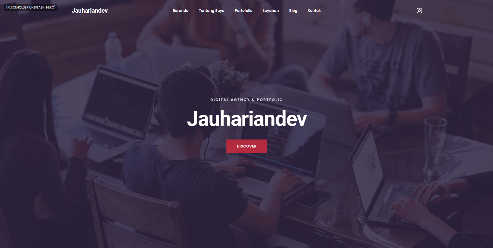
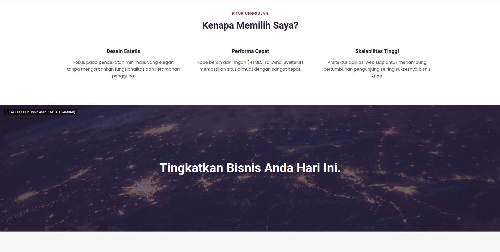
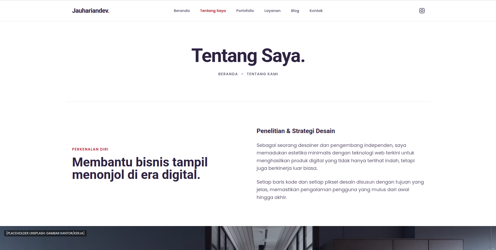
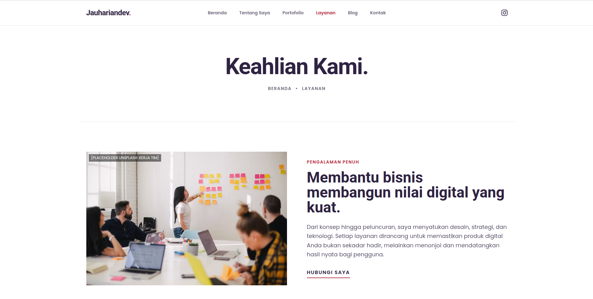
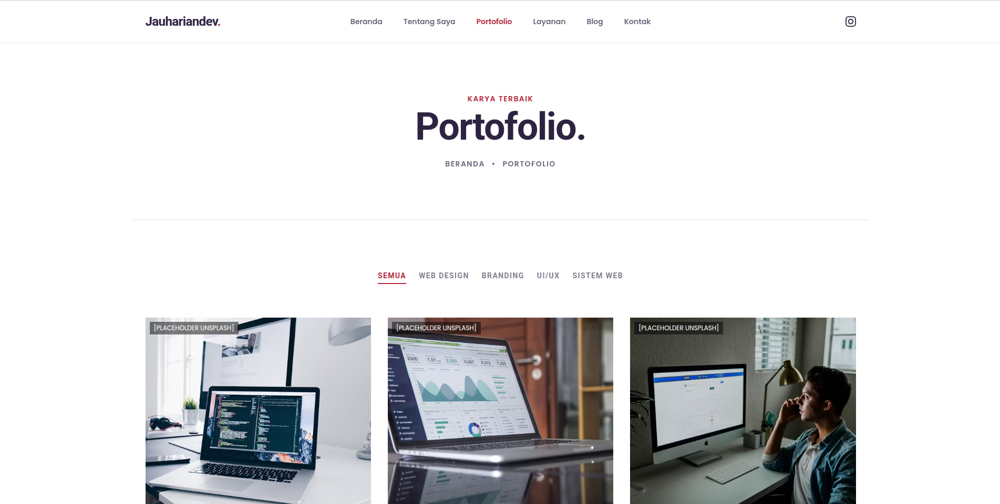
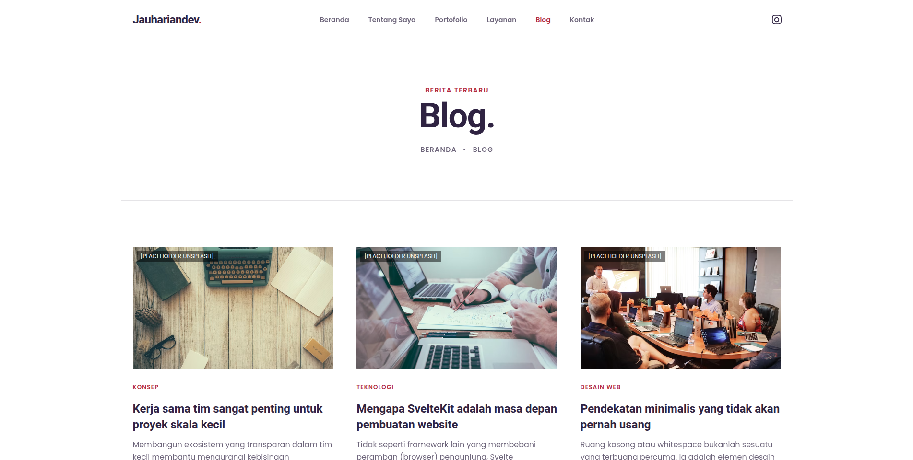
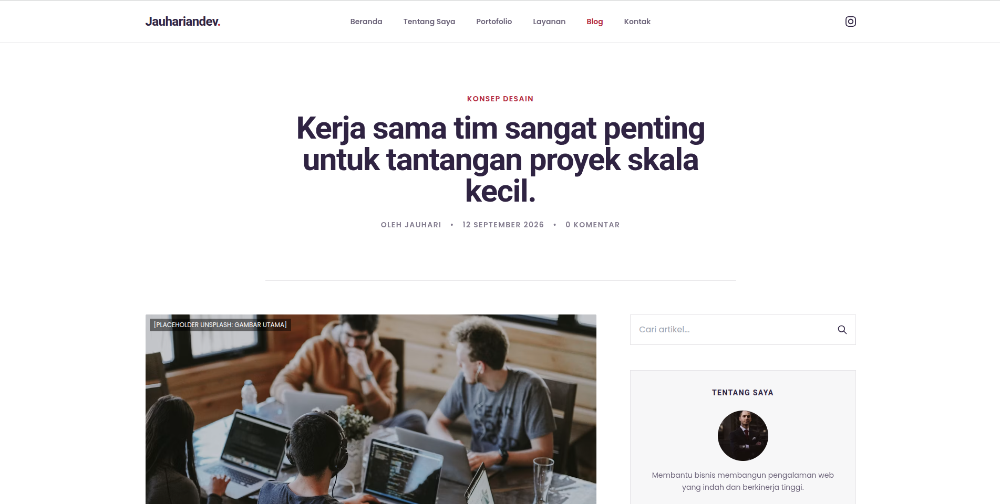
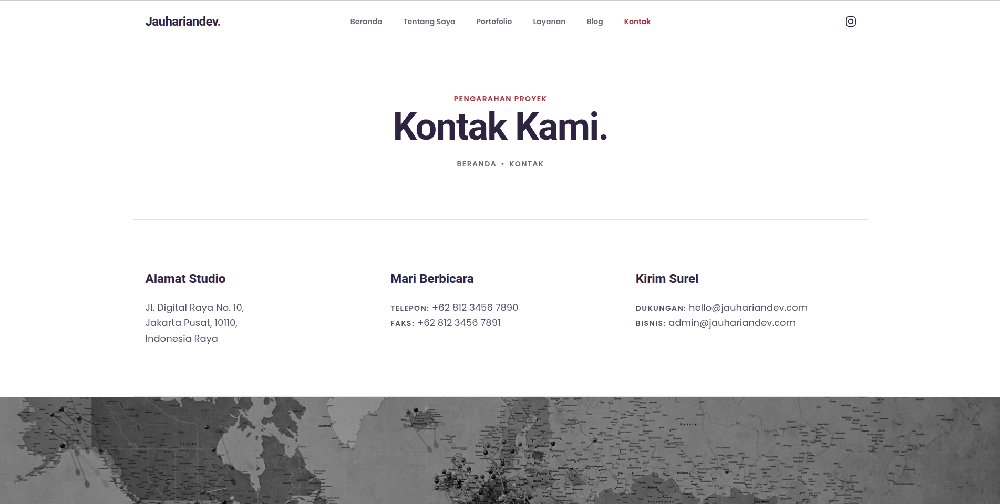

# Jauhariandev - Portfolio & Layanan Digital

Platform portofolio dan penyedia jasa digital (agensi) untuk **Jauhariandev**. Platform ini dirancang tidak hanya untuk menampilkan karya dan profil, tetapi juga sebagai mesin *e-commerce* sederhana yang memungkinkan pengunjung untuk melihat layanan, melakukan *checkout*, dan mengonfirmasi pesanan (pembayaran via QRIS statis) secara langsung tanpa perlu *login*.

## 🚀 Teknologi Utama (Tech Stack)

Proyek ini dibangun menggunakan arsitektur modern yang ringan dan Edge-optimized:
- **Frontend**: [SvelteKit](https://kit.svelte.dev/) (menggunakan fitur reaktif terbaru Svelte 5 Runes) + Tailwind CSS
- **Backend / API**: [Hono](https://hono.dev/) (dieksekusi di lingkungan Cloudflare Workers)
- **Database**: [Neon Serverless PostgreSQL](https://neon.tech/) dengan [Drizzle ORM](https://orm.drizzle.team/)
- **Validasi Data**: Zod
- **Storage / Media**: [Cloudinary](https://cloudinary.com/) (terintegrasi sebagai Media Library)
- **Autentikasi**: [Better Auth](https://better-auth.vercel.app/)
- **Hosting**: Cloudflare Pages (Front-end) & Workers (Back-end)
- **Utilitas**: jsPDF (untuk otomasi cetak PDF kwitansi pembayaran)

## 📋 Fitur Utama

### Sisi Publik (Front-End)
1. **Beranda**: Rangkuman keahlian, pameran jasa, *highlight* portofolio, dan ulasan (*testimonials*).
2. **Tentang Saya**: Profil mendetail, nilai utama, dan keahlian teknis.
3. **Layanan**: Katalog jasa digital dengan variasi paket harga. Pengunjung dapat memilih paket, masuk ke *popup checkout*, lalu diarahkan ke halaman instruksi pembayaran (QRIS) dan konfirmasi via WhatsApp.
4. **Portofolio**: Etalase karya dan proyek yang telah diselesaikan.
5. **Blog**: Publikasi artikel seputar teknologi, web, dan desain.
6. **Kontak**: Informasi penghubung dan formulir pesan cepat.

### Sisi Admin (Dashboard Terotentikasi)
- **Manajemen Konten (CMS)**: Mengedit teks dan konten pada halaman publik secara dinamis.
- **Manajemen Jasa & Portofolio**: Menambah, mengubah, atau menghapus daftar karya dan paket layanan.
- **Media Library**: Sistem pengelolaan aset gambar layaknya WordPress. Gambar yang diunggah dapat disisipkan ke halaman manapun.
- **Manajemen Blog**: *Rich Text Editor* untuk penulisan artikel dan penentuan *Featured Image*.
- **Laporan Transaksi**: Dasbor pemantauan penjualan (ringkasan mingguan/bulanan).
- **Sistem Kwitansi (PDF)**: Pembuatan dan pengunduhan bukti bayar berformat PDF secara otomatis untuk pelanggan.

## 📂 Dokumentasi Proyek

Untuk memahami alur logika, rancangan teknis, dan struktur basis data proyek ini secara utuh, silakan baca dokumen berikut pada direktori `docs/`:

- 📄 [Product Requirements Document (PRD)](docs/PRD.md)
- 📄 [Technical Design Document (TDD)](docs/TDD.md)
- 📄 [Database Schema (DBS)](docs/DB-SCHEMA.md)
- 📄 [Rencana Pengerjaan (Sprint Plan)](docs/SPRINT-PLAN.md)
- 📄 [Referensi & Panduan UI](docs/REFERENSI-UI.md)

---

## 🎨 Pratinjau Antarmuka (UI Prototypes)

Seluruh rancangan awal *front-end* publik telah diubah menjadi prototipe HTML/Tailwind statis yang utuh. Anda dapat menavigasikannya secara interaktif melalui berkas [**`docs/ui/index.html`**](docs/ui/index.html).

Berikut adalah tangkapan layar antarmukanya (*mockup* UI):

### 1. Beranda

### 2. Tentang Saya

### 3. Layanan & Paket Harga

### 4. Portofolio Karya

### 5. Blog

### 6. Kontak

---
*Proyek ini mematuhi standar desain [DESIGN.md](DESIGN.md).*
