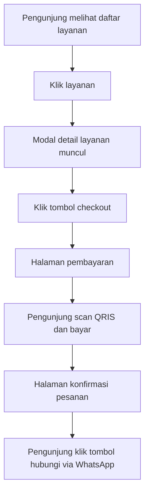
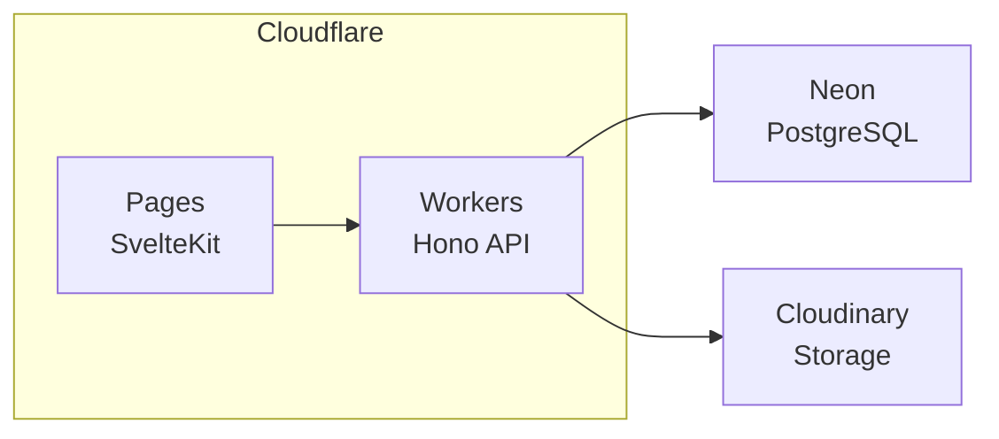

# Product Requirements Document (PRD)

## Jauhariandev Portfolio

**Versi:** alpha
**Terakhir diperbarui:** 2026-09-06

---

## 1. Ringkasan Produk

Website portofolio untuk layanan jasa Jauhariandev. Berfungsi sebagai etalase digital yang menampilkan profil, portofolio pekerjaan, dan katalog layanan yang bisa dipesan langsung oleh pengunjung tanpa perlu membuat akun.

### Tujuan Bisnis

- Menampilkan profil dan portofolio secara profesional
- Menjual layanan jasa langsung melalui website
- Menerima pembayaran via QRIS statis
- Mengelola pesanan dan mencetak kwitansi dari satu dashboard

### Halaman

| No | Halaman | Akses |
|----|---------|-------|
| 1 | Beranda | Publik |
| 2 | Tentang Saya | Publik |
| 3 | Portofolio | Publik |
| 4 | Layanan | Publik |
| 5 | Blog | Publik |
| 6 | Kontak | Publik |
| 7 | Checkout & Pembayaran | Publik |
| 8 | Konfirmasi Pesanan | Publik |
| 9 | Dashboard Admin | Private (auth) |

---

## 2. User Personas

### Admin (Pemilik)

- Satu-satunya pengguna yang mengakses dashboard
- Mengelola konten semua halaman publik
- Menambah/mengedit layanan dan portofolio
- Mengelola blog (kategori, post, richtext editor)
- Mengelola media library (upload, pilih gambar)
- Mengupload gambar QRIS statis
- Memverifikasi pesanan dan mencetak kwitansi
- Melihat laporan penjualan

### Pengunjung (Calon Pembeli)

- Melihat profil, portofolio, dan daftar layanan
- Membaca artikel blog
- Memesan layanan tanpa perlu login atau membuat akun
- Melakukan pembayaran via QRIS
- Menghubungi admin via WhatsApp setelah pembayaran

---

## 3. Halaman Publik

### 3.1 Beranda

Halaman utama yang menjadi first impression pengunjung. Konten dapat diedit via dashboard admin.

### 3.2 Tentang Saya

Halaman profil yang menampilkan informasi tentang Jauhariandev. Konten dapat diedit via dashboard admin.

### 3.3 Portofolio

Menampilkan daftar project yang sudah selesai.

**Fitur admin:**
- Menambahkan project baru
- Mengedit project yang sudah ada

### 3.4 Layanan

Menampilkan katalog layanan jasa yang tersedia.

**Informasi per layanan (tampilan katalog):**

| Field | Tipe |
|-------|------|
| Foto | Gambar |
| Judul layanan | Teks |
| Harga | Angka (Rupiah) |

**Detail layanan (modal popup saat diklik):**

| Field | Tipe |
|-------|------|
| Foto | Gambar |
| Judul layanan | Teks |
| Harga | Angka (Rupiah) |
| Deskripsi | Teks panjang |
| Tombol checkout | Aksi |

**Fitur admin:**
- Menambahkan layanan baru
- Mengedit layanan yang sudah ada

### 3.5 Blog

Halaman blog untuk berbagi artikel dan konten.

**Tampilan publik:**
- Daftar post dengan feature image, judul, excerpt, kategori, dan tanggal
- Halaman detail post dengan konten lengkap (HTML dari richtext editor)
- Filter post berdasarkan kategori

**Fitur admin:**
- Tambah kategori baru
- Buat post baru dengan richtext editor
- Edit post yang sudah ada
- Tambahkan feature image untuk setiap post
- Sisipkan foto ke dalam konten post via media library
- Publish/draft toggle

### 3.6 Kontak

Halaman kontak untuk menghubungi Jauhariandev. Konten dapat diedit via dashboard admin.

---

## 4. Alur Checkout dan Pembayaran

### 4.1 Flow

### 4.2 Halaman Pembayaran

Menampilkan:

- Detail layanan yang dipesan (judul, harga)
- Total harga = harga layanan + 3 digit unik
- Gambar QRIS statis (diupload admin via dashboard)
- Panduan pembayaran

**Kode unik 3 digit:** ditambahkan ke total harga untuk memudahkan admin mengidentifikasi dan memverifikasi pesanan. Contoh: harga layanan Rp 500.000 menjadi Rp 500.123.

### 4.3 Halaman Konfirmasi Pesanan

Setelah pembayaran, pengunjung diarahkan ke halaman yang berisi:

- Ringkasan pesanan
- Tombol untuk menghubungi admin via WhatsApp dengan detail pesanan yang sudah terformat

---

## 5. Dashboard Admin

### 5.1 Manajemen Konten Halaman

Admin dapat mengedit konten semua halaman publik secara dinamis:
- Beranda
- Tentang Saya
- Portofolio
- Layanan
- Blog
- Kontak

### 5.2 Manajemen Portofolio

- Menambahkan project baru
- Mengedit project yang sudah ada

### 5.3 Manajemen Layanan

- Menambahkan layanan baru (foto, judul, harga, deskripsi)
- Mengedit layanan yang sudah ada

### 5.4 Upload QRIS

- Upload gambar QRIS statis yang ditampilkan di halaman pembayaran
- Gambar disimpan di Cloudinary

### 5.5 Laporan Penjualan

- Laporan penjualan mingguan
- Laporan penjualan bulanan

### 5.6 Kwitansi Pembayaran

- Mencetak/download kwitansi untuk pesanan yang sudah diverifikasi
- Kwitansi bisa dikirim ke pemesan layanan

### 5.7 Manajemen Blog

**Kategori:**
- Menambahkan kategori baru
- Mengedit kategori yang sudah ada

**Post:**
- Membuat post baru
- Mengedit post yang sudah ada
- Richtext editor untuk menulis konten post
- Menambahkan feature image
- Menyisipkan foto ke dalam konten via media library
- Mengatur status publish/draft

### 5.8 Media Library

Mengelola semua gambar yang diupload ke dalam sistem, seperti WordPress.

- Menampilkan semua gambar yang sudah diupload
- Saat klik "tambah gambar" dari menu manapun (layanan, portofolio, blog), muncul popup media library
- Popup menampilkan gambar yang sudah ada dan bisa dipilih langsung
- Tombol upload gambar baru tersedia di dalam popup
- Gambar disimpan di Cloudinary

---

## 6. Arsitektur Teknis

### 6.1 Tech Stack

| Layer | Teknologi |
|-------|-----------|
| Frontend | SvelteKit (Svelte 5 runes) |
| Backend | Hono |
| Database | Neon (PostgreSQL) |
| Storage | Cloudinary |
| Hosting Frontend | Cloudflare Pages |
| Hosting Backend | Cloudflare Workers |
| Bahasa | TypeScript (strict mode) |
| Styling | Tailwind CSS |
| Testing | Jest |

### 6.2 Diagram Arsitektur

### 6.3 Keputusan Teknis

- **ESM only** — tidak ada CommonJS di kode baru
- **Node 20+** — menggunakan built-in API (`node:fs/promises`, `fetch`)
- **Svelte 5 runes** — `$state`, `$derived`, `$effect`
- **Tailwind utility classes** — tidak ada custom CSS kecuali benar-benar diperlukan
- **Environment variables** — semua secret dimuat dari env, bukan hardcode

---

## 7. Design System

Referensi lengkap ada di [DESIGN.md](../DESIGN.md).

### 7.1 Palet Warna

| Token | Hex | Penggunaan |
|-------|-----|------------|
| `primary` | #2F2342 | Warna utama teks dan elemen |
| `secondary` | #0C3C78 | Warna pendukung |
| `tertiary` | #B42B3F | Aksen, CTA, elemen berpenekanan tinggi |
| `neutral` | #F7F7F8 | Background utama (warm neutral) |
| `surface` | #FFFFFF | Background card dan elemen terangkat |
| `on-tertiary` | #FFFFFF | Teks di atas warna tertiary |
| `border` | #E5E4E7 | Garis batas, hairline border |

### 7.2 Tipografi

| Token | Font | Ukuran | Berat |
|-------|------|--------|-------|
| `h1` | Roboto | 3rem | 700 |
| `body-md` | Poppins | 1rem | 400 |
| `label-caps` | Poppins | 0.75rem | 600 |

### 7.3 Spacing dan Radius

**Spacing:** `sm` 8px, `md` 16px, `lg` 24px

**Border radius:** `sm` 4px, `md` 8px

### 7.4 Prinsip Visual

- Depth melalui tonal layering dan subtle border, bukan drop shadow
- Card terangkat dari background neutral via surface putih dan hairline border
- Warna tertiary digunakan hemat, hanya untuk aksi paling penting
- Maksimal dua font family per layar
- Background default warm neutral, putih hanya untuk card

---

## 8. Non-Functional Requirements

### Performa

- Halaman publik dimuat cepat (target < 3 detik pada 3G)
- Gambar dioptimasi via Cloudinary transformations

### Keamanan

- Dashboard admin dilindungi autentikasi
- Input divalidasi di boundary (frontend dan backend)
- Secret hanya dari environment variables

### Aksesibilitas

- Kontras teks memenuhi WCAG AA (4.5:1 normal, 3:1 large text)
- Semua elemen interaktif dapat diakses via keyboard
- Focus state terlihat jelas

---

## 9. Batasan dan Asumsi

### Batasan

- Pembayaran hanya via QRIS statis (tidak ada payment gateway otomatis)
- Verifikasi pembayaran dilakukan manual oleh admin
- Admin adalah pengguna tunggal, tidak ada multi-user

### Asumsi

- Pengunjung memiliki aplikasi pembayaran yang mendukung QRIS
- Pengunjung memiliki WhatsApp untuk konfirmasi pesanan
- Admin memiliki akses ke Cloudflare, Neon, dan Cloudinary untuk deployment
