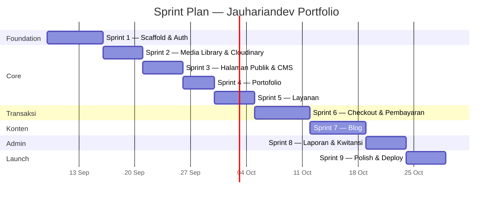
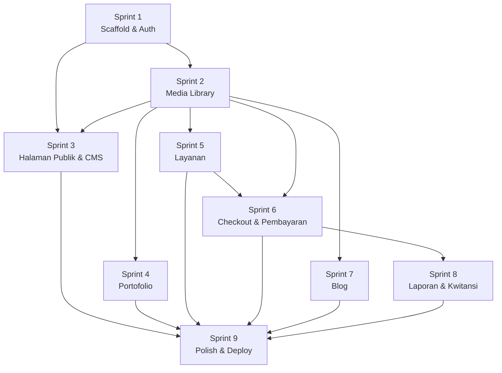

# Sprint Plan & Backlog

## Jauhariandev Portfolio

**Versi:** alpha
**Terakhir diperbarui:** 2026-09-06
**Referensi:** [PRD.md](./PRD.md) · [TDD.md](./TDD.md) · [DBS-SCHEMA.md](./DBS-SCHEMA.md)

---

## Ringkasan Sprint

| Sprint | Nama | Durasi | Scope |
|--------|------|--------|-------|
| 1 | Scaffold & Auth | 1 minggu | Monorepo, DB, migrasi, Better Auth, layout dasar |
| 2 | Media Library & Cloudinary | 5 hari | Upload, media table, MediaPicker, Cloudinary |
| 3 | Halaman Publik & CMS | 5 hari | Pages CRUD, Beranda, Tentang, Kontak, admin editor |
| 4 | Portofolio | 4 hari | Portfolios CRUD, halaman publik, admin management |
| 5 | Layanan | 5 hari | Services CRUD, halaman publik, modal detail |
| 6 | Checkout & Pembayaran | 1 minggu | Orders, kode unik, QRIS, WhatsApp, checkout flow |
| 7 | Blog | 1 minggu | Categories, posts, Tiptap editor, halaman publik |
| 8 | Laporan & Kwitansi | 5 hari | Laporan mingguan/bulanan, kwitansi PDF, manajemen pesanan |
| 9 | Polish & Deploy | 5 hari | Testing, responsive, performa, deploy Cloudflare |

**Urutan dipilih berdasarkan dependency:**
- Media Library di sprint 2 karena dibutuhkan oleh Portofolio, Layanan, Blog, dan QRIS
- Layanan sebelum Checkout karena checkout bergantung pada data layanan
- Blog setelah checkout karena independen dan media library sudah siap

---

## Sprint 1 — Scaffold & Auth

**Tujuan:** Setup fondasi project sehingga semua sprint berikutnya bisa langsung develop fitur.

### Backlog

| ID | Task | Detail | Estimasi |
|----|------|--------|----------|
| S1-01 | Init monorepo | `pnpm-workspace.yaml`, root `package.json`, `turbo.json` | 1h |
| S1-02 | Setup `packages/db` | Install `drizzle-orm`, `@neondatabase/serverless`, `drizzle-kit`. Buat `drizzle.config.ts`, `src/index.ts` (createDb) | 2h |
| S1-03 | Buat semua schema files | `pages.ts`, `portfolios.ts`, `services.ts`, `orders.ts`, `categories.ts`, `posts.ts`, `media.ts`, `settings.ts`, `index.ts` (re-export) | 3h |
| S1-04 | Generate & apply migrasi | `drizzle-kit generate` + `drizzle-kit migrate` ke Neon | 1h |
| S1-05 | Setup `packages/types` | Buat `validators.ts` (semua Zod schemas), `api.ts` (AppType re-export), `index.ts` | 2h |
| S1-06 | Setup `apps/api` | Init Hono app, `wrangler.toml`, CORS middleware, env types, route structure kosong | 2h |
| S1-07 | Setup Better Auth | Install `better-auth`, buat `lib/auth.ts`, `middleware/auth.ts`, `routes/auth.ts`. Generate auth tables | 3h |
| S1-08 | Seed admin user | Script seed untuk membuat admin pertama | 1h |
| S1-09 | Setup `apps/web` | Init SvelteKit, `adapter-cloudflare`, Tailwind CSS, design tokens di `tailwind.config.ts` | 2h |
| S1-10 | Hono RPC client | Buat `src/lib/api.ts` dengan `hc<AppType>` | 1h |
| S1-11 | Admin auth guard | `admin/+layout.svelte` + `admin/+layout.server.ts`, halaman login | 3h |
| S1-12 | Layout publik | `(public)/+layout.svelte` dengan navbar dan footer | 2h |
| S1-13 | Admin layout | Sidebar navigasi dashboard | 2h |
| S1-14 | Setup environment | `.dev.vars` (API), `.env` (web), dokumentasi setup | 1h |

**Definition of Done:**
- `pnpm dev` berjalan tanpa error di kedua app
- Admin bisa login dan melihat dashboard kosong
- Halaman publik menampilkan layout dengan navbar/footer
- Migrasi database berhasil, semua tabel terbuat di Neon
- Auth middleware memblokir akses ke `/admin/*` tanpa session

---

## Sprint 2 — Media Library & Cloudinary

**Tujuan:** Media library berfungsi penuh sehingga sprint berikutnya bisa langsung pakai untuk upload gambar.

**Dependency:** Sprint 1 (auth, API, DB)

### Backlog

| ID | Task | Detail | Estimasi |
|----|------|--------|----------|
| S2-01 | Cloudinary helper | `apps/api/src/lib/cloudinary.ts` — `configureCloudinary()`, `uploadImage()`, `deleteImage()` | 2h |
| S2-02 | API: GET `/api/admin/media` | Daftar semua media, paginated, sorted by `created_at` desc | 2h |
| S2-03 | API: POST `/api/admin/media` | Upload file → Cloudinary → simpan metadata ke tabel `media` | 3h |
| S2-04 | API: DELETE `/api/admin/media/:id` | Hapus dari Cloudinary (by `public_id`) + hapus record dari DB | 2h |
| S2-05 | Halaman admin media library | `admin/media/+page.svelte` — grid gambar, tombol upload, tombol hapus | 4h |
| S2-06 | Komponen `MediaPicker` | Popup/modal reusable: tampilkan grid media, pilih gambar, upload baru. Return URL ke pemanggil | 4h |
| S2-07 | Test upload flow | Upload gambar → muncul di grid → pilih → return URL | 2h |

**Definition of Done:**
- Admin bisa upload gambar dari halaman media library
- Admin bisa hapus gambar dari media library
- Komponen `MediaPicker` bisa dipanggil dari mana saja dan return URL
- Gambar tersimpan di Cloudinary folder `portofolio/media/`

---

## Sprint 3 — Halaman Publik & CMS

**Tujuan:** Halaman statis (Beranda, Tentang, Kontak) bisa ditampilkan dan diedit admin.

**Dependency:** Sprint 1 (layout, auth), Sprint 2 (media picker untuk gambar di konten)

### Backlog

| ID | Task | Detail | Estimasi |
|----|------|--------|----------|
| S3-01 | API: GET `/api/public/pages/:slug` | Ambil konten halaman by slug | 1h |
| S3-02 | API: PUT `/api/admin/pages/:slug` | Update konten halaman (title + content) | 1h |
| S3-03 | Seed halaman default | Insert `beranda`, `tentang`, `kontak` dengan konten placeholder | 1h |
| S3-04 | Halaman Beranda | `(public)/+page.svelte` — render konten dari DB | 3h |
| S3-05 | Halaman Tentang Saya | `(public)/tentang/+page.svelte` | 2h |
| S3-06 | Halaman Kontak | `(public)/kontak/+page.svelte` | 2h |
| S3-07 | Admin: editor halaman | `admin/halaman/+page.svelte` — pilih halaman, edit title/content, simpan | 4h |
| S3-08 | API: GET `/api/public/settings/:key` | Ambil setting publik (site_name, dll) | 1h |

**Definition of Done:**
- Tiga halaman publik menampilkan konten dari database
- Admin bisa mengedit konten ketiga halaman dan perubahan langsung terlihat
- Settings API berfungsi

---

## Sprint 4 — Portofolio

**Tujuan:** Halaman portofolio menampilkan project dan admin bisa mengelolanya.

**Dependency:** Sprint 2 (media picker untuk foto project)

### Backlog

| ID | Task | Detail | Estimasi |
|----|------|--------|----------|
| S4-01 | API: GET `/api/public/portfolios` | Daftar portfolio, sorted by `sort_order` | 1h |
| S4-02 | API: POST `/api/admin/portfolios` | Tambah portfolio baru (dengan Zod validation) | 2h |
| S4-03 | API: PUT `/api/admin/portfolios/:id` | Edit portfolio | 1h |
| S4-04 | API: DELETE `/api/admin/portfolios/:id` | Hapus portfolio | 1h |
| S4-05 | Halaman publik portofolio | `(public)/portofolio/+page.svelte` — grid/list project | 3h |
| S4-06 | Admin: CRUD portofolio | `admin/portofolio/+page.svelte` — list, form tambah/edit, hapus, pilih foto via MediaPicker | 4h |

**Definition of Done:**
- Halaman publik menampilkan daftar project dengan foto
- Admin bisa tambah, edit, hapus project
- Foto project dipilih via MediaPicker

---

## Sprint 5 — Layanan

**Tujuan:** Katalog layanan dengan modal detail berfungsi penuh.

**Dependency:** Sprint 2 (media picker untuk foto layanan)

### Backlog

| ID | Task | Detail | Estimasi |
|----|------|--------|----------|
| S5-01 | API: GET `/api/public/services` | Daftar layanan aktif | 1h |
| S5-02 | API: GET `/api/public/services/:id` | Detail satu layanan | 1h |
| S5-03 | API: POST `/api/admin/services` | Tambah layanan baru | 2h |
| S5-04 | API: PUT `/api/admin/services/:id` | Edit layanan | 1h |
| S5-05 | API: DELETE `/api/admin/services/:id` | Hapus layanan | 1h |
| S5-06 | Halaman publik layanan | `(public)/layanan/+page.svelte` — grid card layanan (foto, judul, harga) | 3h |
| S5-07 | Modal detail layanan | Popup saat klik card: foto, judul, harga, deskripsi, tombol checkout | 3h |
| S5-08 | Admin: CRUD layanan | `admin/layanan/+page.svelte` — list, form tambah/edit (foto via MediaPicker), toggle aktif/nonaktif | 4h |

**Definition of Done:**
- Halaman publik menampilkan grid layanan aktif
- Klik layanan membuka modal dengan detail dan tombol checkout
- Admin bisa CRUD layanan, toggle aktif/nonaktif
- Foto layanan dipilih via MediaPicker

---

## Sprint 6 — Checkout & Pembayaran

**Tujuan:** Pengunjung bisa memesan layanan, bayar via QRIS, dan konfirmasi via WhatsApp.

**Dependency:** Sprint 5 (layanan), Sprint 2 (media picker untuk QRIS)

### Backlog

| ID | Task | Detail | Estimasi |
|----|------|--------|----------|
| S6-01 | Kode unik 3 digit | `apps/api/src/lib/unique-code.ts` — generate 100-999, collision check per hari | 2h |
| S6-02 | API: POST `/api/orders` | Buat pesanan: validasi service, generate kode unik, hitung total, insert order | 3h |
| S6-03 | API: GET `/api/orders/:id` | Detail pesanan + data service (untuk halaman pembayaran) | 1h |
| S6-04 | API: PATCH `/api/orders/:id/confirm` | Pengunjung konfirmasi sudah bayar → status `paid` | 1h |
| S6-05 | Form checkout | Setelah klik "Checkout" di modal → form nama + WhatsApp → POST order | 3h |
| S6-06 | Halaman pembayaran | `checkout/[orderId]/+page.svelte` — detail pesanan, total + kode unik, gambar QRIS, panduan bayar | 4h |
| S6-07 | Halaman konfirmasi | `checkout/[orderId]/konfirmasi/+page.svelte` — ringkasan + tombol WhatsApp | 3h |
| S6-08 | WhatsApp deep link builder | `apps/web/src/lib/utils/whatsapp.ts` — format pesan, generate `wa.me` URL | 1h |
| S6-09 | Admin: upload QRIS | `admin/pengaturan/+page.svelte` — upload gambar QRIS via MediaPicker, simpan ke settings | 2h |
| S6-10 | Admin: setting WhatsApp | Input nomor WhatsApp di halaman pengaturan, simpan ke settings | 1h |
| S6-11 | API: PUT `/api/admin/settings/:key` | Update setting | 1h |
| S6-12 | Test checkout flow end-to-end | Pilih layanan → checkout → bayar → konfirmasi → WhatsApp | 2h |

**Definition of Done:**
- Pengunjung bisa checkout tanpa login
- Halaman pembayaran menampilkan QRIS + total harga + kode unik
- Setelah "Sudah Bayar", muncul tombol WhatsApp dengan pesan terformat
- Admin bisa upload QRIS dan set nomor WhatsApp
- Kode unik tidak duplikat dalam satu hari

---

## Sprint 7 — Blog

**Tujuan:** Sistem blog lengkap dengan kategori, richtext editor, dan halaman publik.

**Dependency:** Sprint 2 (media picker untuk feature image dan sisipan gambar)

### Backlog

| ID | Task | Detail | Estimasi |
|----|------|--------|----------|
| S7-01 | Setup Tiptap | Install `@tiptap/core`, `svelte-tiptap`, `@tiptap/starter-kit`, `@tiptap/extension-image` | 1h |
| S7-02 | Komponen RichTextEditor | `RichTextEditor.svelte` — toolbar, integrasi MediaPicker untuk sisipkan gambar | 4h |
| S7-03 | API: kategori CRUD | POST/PUT/DELETE `/api/blog/admin/categories` | 2h |
| S7-04 | API: GET `/api/blog/categories` | Daftar kategori (publik) | 1h |
| S7-05 | API: POST `/api/blog/admin` | Buat post baru (title, slug, content, excerpt, featureImageUrl, categoryId, isPublished) | 2h |
| S7-06 | API: PUT `/api/blog/admin/:id` | Edit post | 1h |
| S7-07 | API: DELETE `/api/blog/admin/:id` | Hapus post | 1h |
| S7-08 | API: GET `/api/blog/admin` | Daftar semua post (termasuk draft) untuk admin | 1h |
| S7-09 | API: GET `/api/blog` | Daftar post published, paginated, filter by kategori | 2h |
| S7-10 | API: GET `/api/blog/:slug` | Detail post by slug | 1h |
| S7-11 | Admin: CRUD kategori | `admin/blog/kategori/+page.svelte` — list, tambah, edit kategori | 3h |
| S7-12 | Admin: CRUD post | `admin/blog/+page.svelte` — list post, form buat/edit dengan RichTextEditor, feature image via MediaPicker, pilih kategori, toggle publish | 6h |
| S7-13 | Halaman publik blog | `(public)/blog/+page.svelte` — daftar post dengan feature image, judul, excerpt, kategori, tanggal. Filter by kategori | 4h |
| S7-14 | Halaman detail post | `(public)/blog/[slug]/+page.svelte` — render HTML konten dengan `@tailwindcss/typography` prose styling | 3h |

**Definition of Done:**
- Admin bisa CRUD kategori dan post
- Richtext editor berfungsi: bold, italic, heading, list, sisipkan gambar
- Halaman publik blog menampilkan post published dengan pagination
- Detail post merender HTML dengan styling prose
- Feature image bisa dipilih via MediaPicker

---

## Sprint 8 — Laporan & Kwitansi

**Tujuan:** Admin bisa mengelola pesanan, melihat laporan penjualan, dan mencetak kwitansi.

**Dependency:** Sprint 6 (orders)

### Backlog

| ID | Task | Detail | Estimasi |
|----|------|--------|----------|
| S8-01 | API: GET `/api/admin/orders` | Daftar semua pesanan (filter by status, sorted by date) | 2h |
| S8-02 | API: PATCH `/api/admin/orders/:id/verify` | Verifikasi pesanan → status `verified`, set `verified_at` | 1h |
| S8-03 | API: PATCH `/api/admin/orders/:id/reject` | Tolak pesanan → status `rejected` | 1h |
| S8-04 | API: GET `/api/admin/orders/:id/receipt` | Data lengkap untuk generate kwitansi PDF | 1h |
| S8-05 | API: GET `/api/admin/reports/weekly` | Laporan 7 hari terakhir, grouped by hari | 2h |
| S8-06 | API: GET `/api/admin/reports/monthly` | Laporan 12 bulan terakhir, grouped by bulan | 2h |
| S8-07 | Admin: daftar pesanan | `admin/pesanan/+page.svelte` — tabel pesanan, filter status, tombol verifikasi/tolak | 4h |
| S8-08 | Admin: laporan penjualan | `admin/laporan/+page.svelte` — toggle mingguan/bulanan, tabel + summary (total orders, total revenue) | 4h |
| S8-09 | Generate kwitansi PDF | `apps/web/src/lib/utils/receipt.ts` — jsPDF template kwitansi, download sebagai file | 3h |
| S8-10 | Tombol cetak kwitansi | Di halaman pesanan, tombol "Cetak Kwitansi" untuk pesanan verified → generate + download PDF | 2h |

**Definition of Done:**
- Admin bisa lihat daftar pesanan dan filter by status
- Admin bisa verifikasi/tolak pesanan
- Laporan mingguan menampilkan data 7 hari terakhir
- Laporan bulanan menampilkan data 12 bulan terakhir
- Kwitansi PDF bisa didownload untuk pesanan yang sudah diverifikasi

---

## Sprint 9 — Polish & Deploy

**Tujuan:** Siap production. Responsive, teruji, dan terdeploy.

**Dependency:** Semua sprint sebelumnya

### Backlog

| ID | Task | Detail | Estimasi |
|----|------|--------|----------|
| S9-01 | Responsive design | Pastikan semua halaman berfungsi baik di mobile (breakpoint sm/md/lg) | 4h |
| S9-02 | Aksesibilitas | Kontras WCAG AA, keyboard navigation, focus states | 3h |
| S9-03 | Error handling | Error boundaries, fallback UI, toast notifications | 3h |
| S9-04 | Loading states | Skeleton loaders, disabled state saat submit | 2h |
| S9-05 | SEO meta tags | Title, description, OG tags untuk halaman publik dan blog | 2h |
| S9-06 | Gambar optimasi | Cloudinary transformations (auto format, quality, resize) | 2h |
| S9-07 | Testing | Unit tests untuk API routes, integration test checkout flow | 6h |
| S9-08 | Deploy API | `wrangler deploy`, set semua secrets di Cloudflare Workers | 2h |
| S9-09 | Deploy Web | Connect repo ke Cloudflare Pages, set env vars | 2h |
| S9-10 | Smoke test production | Test semua flow di production: halaman publik, checkout, admin | 2h |
| S9-11 | Dokumentasi | README.md setup guide, env vars checklist | 2h |

**Definition of Done:**
- Semua halaman responsive dan accessible
- Build tanpa error, tests pass
- Terdeploy di Cloudflare (Pages + Workers)
- Smoke test production berhasil

---

## Backlog Lengkap (Flat)

| ID | Sprint | Task | Prioritas | Status |
|----|--------|------|-----------|--------|
| S1-01 | 1 | Init monorepo | P0 | ⬜ |
| S1-02 | 1 | Setup `packages/db` | P0 | ⬜ |
| S1-03 | 1 | Buat semua schema files | P0 | ⬜ |
| S1-04 | 1 | Generate & apply migrasi | P0 | ⬜ |
| S1-05 | 1 | Setup `packages/types` | P0 | ⬜ |
| S1-06 | 1 | Setup `apps/api` (Hono) | P0 | ⬜ |
| S1-07 | 1 | Setup Better Auth | P0 | ⬜ |
| S1-08 | 1 | Seed admin user | P0 | ⬜ |
| S1-09 | 1 | Setup `apps/web` (SvelteKit) | P0 | ⬜ |
| S1-10 | 1 | Hono RPC client | P0 | ⬜ |
| S1-11 | 1 | Admin auth guard | P0 | ⬜ |
| S1-12 | 1 | Layout publik (navbar/footer) | P0 | ⬜ |
| S1-13 | 1 | Admin layout (sidebar) | P0 | ⬜ |
| S1-14 | 1 | Setup environment files | P0 | ⬜ |
| S2-01 | 2 | Cloudinary helper | P0 | ⬜ |
| S2-02 | 2 | API: GET media list | P0 | ⬜ |
| S2-03 | 2 | API: POST upload media | P0 | ⬜ |
| S2-04 | 2 | API: DELETE media | P0 | ⬜ |
| S2-05 | 2 | Halaman admin media library | P0 | ⬜ |
| S2-06 | 2 | Komponen MediaPicker | P0 | ⬜ |
| S2-07 | 2 | Test upload flow | P0 | ⬜ |
| S3-01 | 3 | API: GET page by slug | P0 | ⬜ |
| S3-02 | 3 | API: PUT update page | P0 | ⬜ |
| S3-03 | 3 | Seed halaman default | P0 | ⬜ |
| S3-04 | 3 | Halaman Beranda | P0 | ⬜ |
| S3-05 | 3 | Halaman Tentang Saya | P0 | ⬜ |
| S3-06 | 3 | Halaman Kontak | P0 | ⬜ |
| S3-07 | 3 | Admin: editor halaman | P0 | ⬜ |
| S3-08 | 3 | API: GET settings | P1 | ⬜ |
| S4-01 | 4 | API: GET portfolios | P0 | ⬜ |
| S4-02 | 4 | API: POST portfolio | P0 | ⬜ |
| S4-03 | 4 | API: PUT portfolio | P0 | ⬜ |
| S4-04 | 4 | API: DELETE portfolio | P0 | ⬜ |
| S4-05 | 4 | Halaman publik portofolio | P0 | ⬜ |
| S4-06 | 4 | Admin: CRUD portofolio | P0 | ⬜ |
| S5-01 | 5 | API: GET services (publik) | P0 | ⬜ |
| S5-02 | 5 | API: GET service detail | P0 | ⬜ |
| S5-03 | 5 | API: POST service | P0 | ⬜ |
| S5-04 | 5 | API: PUT service | P0 | ⬜ |
| S5-05 | 5 | API: DELETE service | P0 | ⬜ |
| S5-06 | 5 | Halaman publik layanan | P0 | ⬜ |
| S5-07 | 5 | Modal detail layanan | P0 | ⬜ |
| S5-08 | 5 | Admin: CRUD layanan | P0 | ⬜ |
| S6-01 | 6 | Generator kode unik 3 digit | P0 | ⬜ |
| S6-02 | 6 | API: POST create order | P0 | ⬜ |
| S6-03 | 6 | API: GET order detail | P0 | ⬜ |
| S6-04 | 6 | API: PATCH confirm order | P0 | ⬜ |
| S6-05 | 6 | Form checkout | P0 | ⬜ |
| S6-06 | 6 | Halaman pembayaran | P0 | ⬜ |
| S6-07 | 6 | Halaman konfirmasi | P0 | ⬜ |
| S6-08 | 6 | WhatsApp deep link builder | P0 | ⬜ |
| S6-09 | 6 | Admin: upload QRIS | P0 | ⬜ |
| S6-10 | 6 | Admin: setting WhatsApp | P0 | ⬜ |
| S6-11 | 6 | API: PUT settings | P0 | ⬜ |
| S6-12 | 6 | Test checkout flow e2e | P0 | ⬜ |
| S7-01 | 7 | Setup Tiptap | P0 | ⬜ |
| S7-02 | 7 | Komponen RichTextEditor | P0 | ⬜ |
| S7-03 | 7 | API: kategori CRUD | P0 | ⬜ |
| S7-04 | 7 | API: GET categories (publik) | P0 | ⬜ |
| S7-05 | 7 | API: POST create post | P0 | ⬜ |
| S7-06 | 7 | API: PUT edit post | P0 | ⬜ |
| S7-07 | 7 | API: DELETE post | P0 | ⬜ |
| S7-08 | 7 | API: GET posts (admin) | P0 | ⬜ |
| S7-09 | 7 | API: GET posts (publik, paginated) | P0 | ⬜ |
| S7-10 | 7 | API: GET post by slug | P0 | ⬜ |
| S7-11 | 7 | Admin: CRUD kategori | P0 | ⬜ |
| S7-12 | 7 | Admin: CRUD post + editor | P0 | ⬜ |
| S7-13 | 7 | Halaman publik blog | P0 | ⬜ |
| S7-14 | 7 | Halaman detail post | P0 | ⬜ |
| S8-01 | 8 | API: GET orders (admin) | P0 | ⬜ |
| S8-02 | 8 | API: PATCH verify order | P0 | ⬜ |
| S8-03 | 8 | API: PATCH reject order | P0 | ⬜ |
| S8-04 | 8 | API: GET receipt data | P0 | ⬜ |
| S8-05 | 8 | API: GET weekly report | P0 | ⬜ |
| S8-06 | 8 | API: GET monthly report | P0 | ⬜ |
| S8-07 | 8 | Admin: daftar pesanan | P0 | ⬜ |
| S8-08 | 8 | Admin: laporan penjualan | P0 | ⬜ |
| S8-09 | 8 | Generate kwitansi PDF (jsPDF) | P0 | ⬜ |
| S8-10 | 8 | Tombol cetak kwitansi | P0 | ⬜ |
| S9-01 | 9 | Responsive design | P0 | ⬜ |
| S9-02 | 9 | Aksesibilitas (WCAG AA) | P0 | ⬜ |
| S9-03 | 9 | Error handling | P0 | ⬜ |
| S9-04 | 9 | Loading states | P1 | ⬜ |
| S9-05 | 9 | SEO meta tags | P1 | ⬜ |
| S9-06 | 9 | Gambar optimasi (Cloudinary) | P1 | ⬜ |
| S9-07 | 9 | Testing | P0 | ⬜ |
| S9-08 | 9 | Deploy API (Cloudflare Workers) | P0 | ⬜ |
| S9-09 | 9 | Deploy Web (Cloudflare Pages) | P0 | ⬜ |
| S9-10 | 9 | Smoke test production | P0 | ⬜ |
| S9-11 | 9 | Dokumentasi | P1 | ⬜ |

---

## Dependency Graph

**Total tasks:** 86
**Estimasi total:** ~55 hari kerja (9 sprint)
