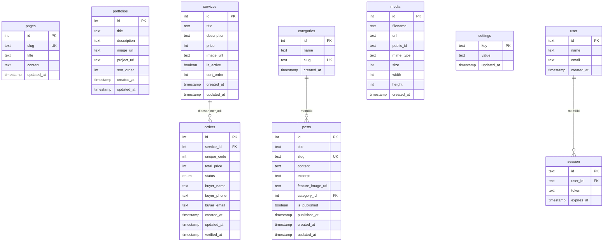
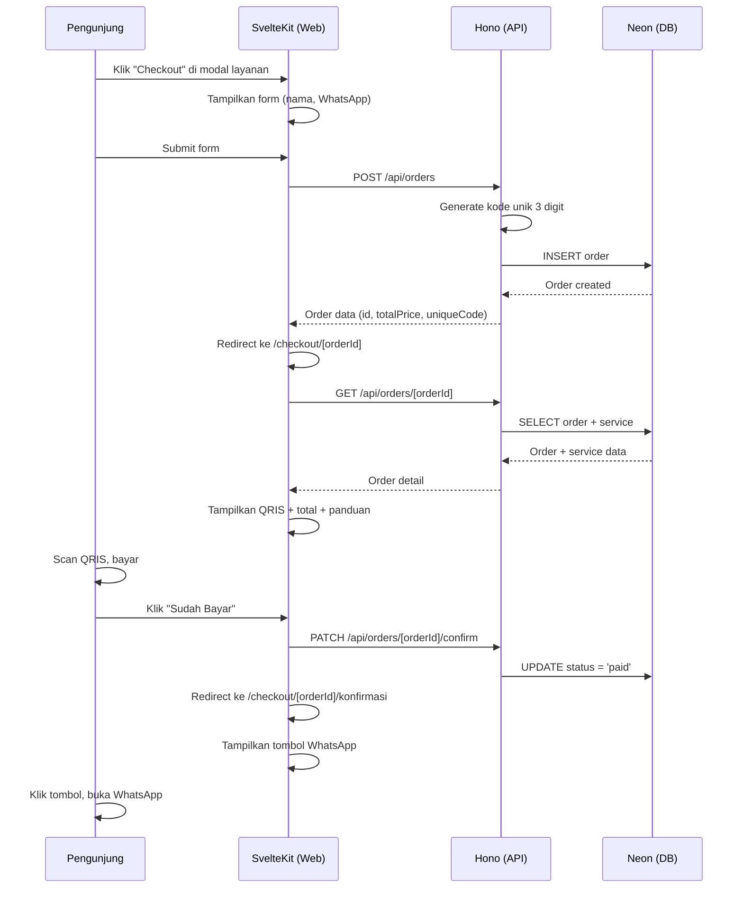
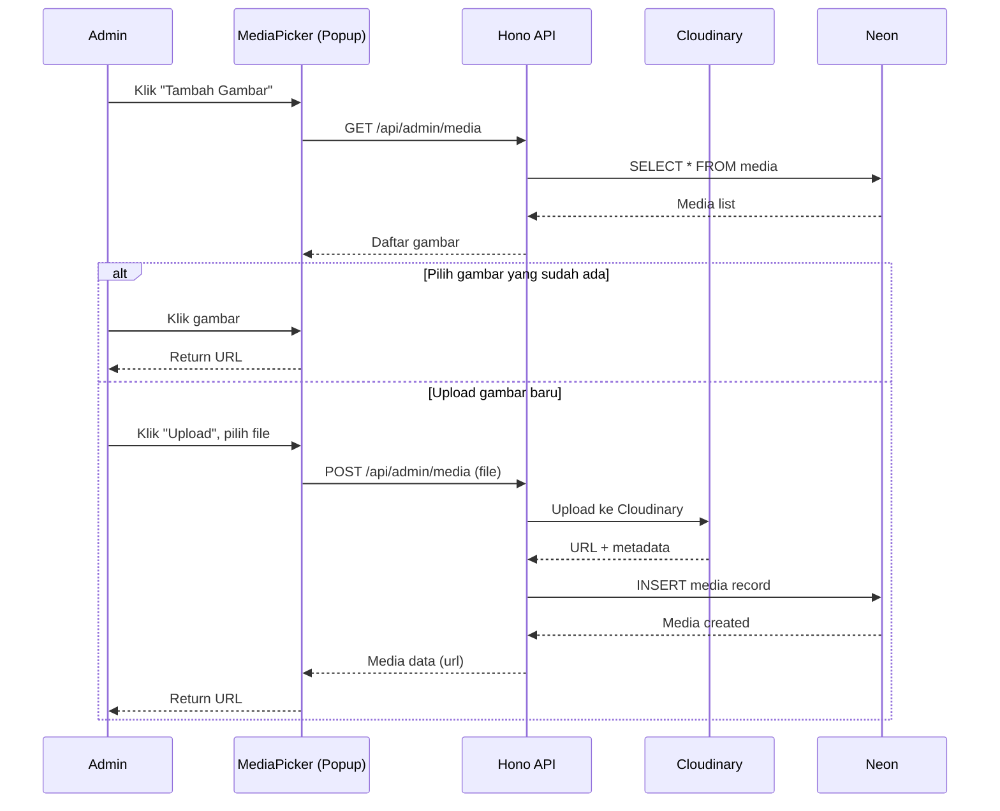
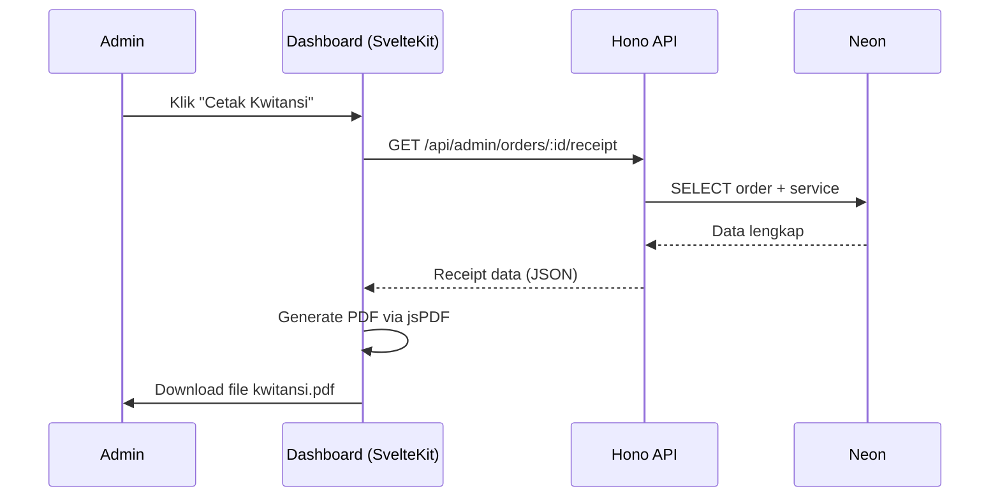
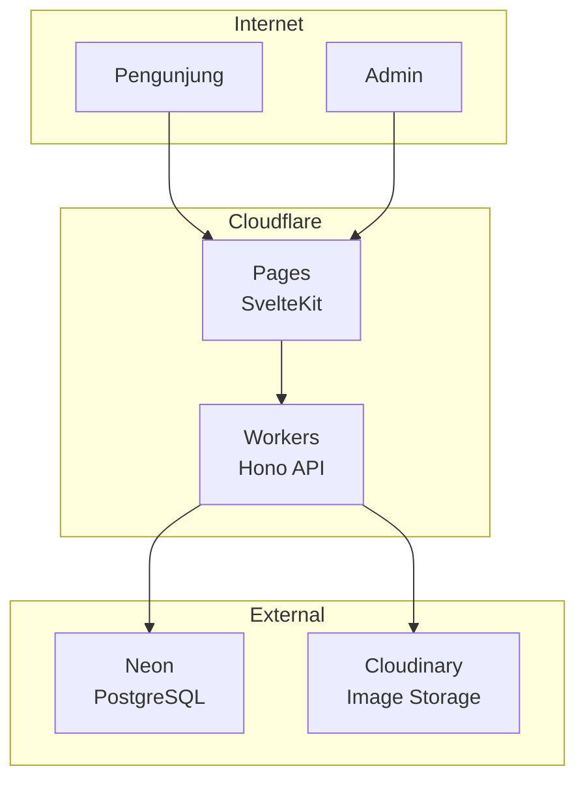

# Technical Design Document (TDD)

## Jauhariandev Portfolio

**Versi:** alpha
**Terakhir diperbarui:** 2026-09-06
**Referensi:** [PRD.md](./PRD.md)

---

## 1. Tech Stack & Dependencies

### Runtime & Framework

| Package | Fungsi |
|---------|--------|
| `hono` | HTTP framework untuk Cloudflare Workers |
| `@sveltejs/kit` | Frontend framework + SSR |
| `@sveltejs/adapter-cloudflare` | Deploy SvelteKit ke Cloudflare Pages |
| `svelte` (v5) | UI components dengan runes |

### Database & ORM

| Package | Fungsi |
|---------|--------|
| `drizzle-orm` | ORM type-safe untuk PostgreSQL |
| `@neondatabase/serverless` | Neon HTTP driver untuk edge |
| `drizzle-kit` | CLI untuk migrasi dan introspeksi (dev dependency) |

### Autentikasi

| Package | Fungsi |
|---------|--------|
| `better-auth` | Auth library dengan session management |
| `better-auth/adapters/drizzle` | Adapter Drizzle untuk Better Auth |

### Validasi

| Package | Fungsi |
|---------|--------|
| `zod` | Schema validation di boundary (API + form) |

### Storage & Media

| Package | Fungsi |
|---------|--------|
| `cloudinary` | Upload dan transformasi gambar |

### PDF

| Package | Fungsi |
|---------|--------|
| `jspdf` | Generate kwitansi PDF (client-side) |

### Styling

| Package | Fungsi |
|---------|--------|
| `tailwindcss` | Utility-first CSS |
| `@tailwindcss/typography` | Prose styling untuk konten dinamis |

### Richtext Editor

| Package | Fungsi |
|---------|--------|
| `@tiptap/core` | Richtext editor framework |
| `svelte-tiptap` | Tiptap adapter untuk Svelte |
| `@tiptap/starter-kit` | Bundle ekstensi dasar (bold, italic, heading, list, dll) |
| `@tiptap/extension-image` | Ekstensi sisipkan gambar |

### Hono RPC

| Package | Fungsi |
|---------|--------|
| `hono/client` | Type-safe RPC client dari SvelteKit ke Hono API |

---

## 2. Monorepo Structure

```
portofolio/
├── apps/
│   ├── web/                          # SvelteKit (Cloudflare Pages)
│   │   ├── src/
│   │   │   ├── lib/
│   │   │   │   ├── api.ts            # Hono RPC client instance
│   │   │   │   ├── components/       # Svelte components
│   │   │   │   └── utils/            # Helper functions
│   │   │   ├── routes/
│   │   │   │   ├── (public)/         # Layout group: halaman publik
│   │   │   │   │   ├── +page.svelte            # Beranda
│   │   │   │   │   ├── tentang/+page.svelte    # Tentang Saya
│   │   │   │   │   ├── portofolio/+page.svelte # Portofolio
│   │   │   │   │   ├── layanan/+page.svelte    # Layanan
│   │   │   │   │   ├── blog/+page.svelte       # Daftar post
│   │   │   │   │   ├── blog/[slug]/+page.svelte # Detail post
│   │   │   │   │   └── kontak/+page.svelte     # Kontak
│   │   │   │   ├── checkout/
│   │   │   │   │   ├── [orderId]/+page.svelte  # Halaman pembayaran
│   │   │   │   │   └── [orderId]/konfirmasi/+page.svelte
│   │   │   │   └── admin/            # Dashboard admin
│   │   │   │       ├── +layout.svelte          # Auth guard
│   │   │   │       ├── +page.svelte            # Dashboard home
│   │   │   │       ├── halaman/+page.svelte    # Edit halaman
│   │   │   │       ├── portofolio/+page.svelte # CRUD portofolio
│   │   │   │       ├── layanan/+page.svelte    # CRUD layanan
│   │   │   │       ├── blog/+page.svelte       # CRUD posts
│   │   │   │       ├── blog/kategori/+page.svelte # CRUD kategori
│   │   │   │       ├── media/+page.svelte      # Media library
│   │   │   │       ├── pesanan/+page.svelte    # Daftar pesanan
│   │   │   │       ├── laporan/+page.svelte    # Laporan penjualan
│   │   │   │       └── pengaturan/+page.svelte # Upload QRIS, WhatsApp
│   │   │   └── app.html
│   │   ├── svelte.config.js
│   │   ├── tailwind.config.ts
│   │   └── package.json
│   │
│   └── api/                          # Hono (Cloudflare Workers)
│       ├── src/
│       │   ├── index.ts              # Hono app entry, export AppType
│       │   ├── routes/
│       │   │   ├── public.ts         # Public API routes
│       │   │   ├── admin.ts          # Admin CRUD routes
│       │   │   ├── orders.ts         # Checkout & order routes
│       │   │   ├── blog.ts           # Blog routes (public + admin)
│       │   │   ├── media.ts          # Media library routes (admin)
│       │   │   └── auth.ts           # Better Auth handler
│       │   ├── middleware/
│       │   │   └── auth.ts           # Auth middleware
│       │   └── lib/
│       │       ├── db.ts             # Drizzle client factory
│       │       ├── auth.ts           # Better Auth instance
│       │       ├── cloudinary.ts     # Cloudinary upload helper
│       │       └── unique-code.ts    # Generator kode unik 3 digit
│       ├── wrangler.toml
│       └── package.json
│
├── packages/
│   ├── db/                           # Shared database schema
│   │   ├── src/
│   │   │   ├── schema/
│   │   │   │   ├── index.ts          # Re-export semua schema
│   │   │   │   ├── pages.ts          # Tabel pages
│   │   │   │   ├── portfolios.ts     # Tabel portfolios
│   │   │   │   ├── services.ts       # Tabel services
│   │   │   │   ├── orders.ts         # Tabel orders
│   │   │   │   ├── categories.ts     # Tabel categories (blog)
│   │   │   │   ├── posts.ts          # Tabel posts (blog)
│   │   │   │   ├── media.ts          # Tabel media (media library)
│   │   │   │   └── settings.ts       # Tabel settings
│   │   │   └── index.ts
│   │   ├── drizzle.config.ts
│   │   └── package.json
│   │
│   └── types/                        # Shared types & Zod schemas
│       ├── src/
│       │   ├── index.ts
│       │   ├── api.ts                # Hono AppType re-export
│       │   └── validators.ts         # Zod schemas untuk input validation
│       └── package.json
│
├── pnpm-workspace.yaml
├── package.json
├── turbo.json                        # Turborepo config (optional)
└── docs/
    ├── PRD.md
    └── TDD.md
```

### Workspace Config

```yaml
# pnpm-workspace.yaml
packages:
  - "apps/*"
  - "packages/*"
```

---

## 3. Database Schema

Driver: `drizzle-orm/neon-http` (dioptimasi untuk edge, non-interactive transactions).

### 3.1 Koneksi Database

```typescript
// packages/db/src/index.ts
import { drizzle } from "drizzle-orm/neon-http";
import { neon } from "@neondatabase/serverless";
import * as schema from "./schema";

export function createDb(databaseUrl: string) {
  const sql = neon(databaseUrl);
  return drizzle(sql, { schema });
}

export type Database = ReturnType<typeof createDb>;
```

### 3.2 Tabel `pages`

Menyimpan konten halaman publik yang bisa diedit admin.

```typescript
// packages/db/src/schema/pages.ts
import { pgTable, text, timestamp, integer } from "drizzle-orm/pg-core";
import { relations } from "drizzle-orm";

export const pages = pgTable("pages", {
  id: integer().primaryKey().generatedAlwaysAsIdentity(),
  slug: text("slug").notNull().unique(),       // "beranda", "tentang", "kontak"
  title: text("title").notNull(),
  content: text("content").notNull(),          // JSON string atau HTML
  updatedAt: timestamp("updated_at").defaultNow().notNull(),
});
```

**Slugs yang digunakan:** `beranda`, `tentang`, `kontak`. Halaman portofolio dan layanan punya tabel terpisah karena kontennya terstruktur.

### 3.3 Tabel `portfolios`

```typescript
// packages/db/src/schema/portfolios.ts
import { pgTable, text, timestamp, integer } from "drizzle-orm/pg-core";

export const portfolios = pgTable("portfolios", {
  id: integer().primaryKey().generatedAlwaysAsIdentity(),
  title: text("title").notNull(),
  description: text("description").notNull(),
  imageUrl: text("image_url").notNull(),        // Cloudinary URL
  projectUrl: text("project_url"),              // Link ke project (opsional)
  sortOrder: integer("sort_order").default(0).notNull(),
  createdAt: timestamp("created_at").defaultNow().notNull(),
  updatedAt: timestamp("updated_at").defaultNow().notNull(),
});
```

### 3.4 Tabel `services`

```typescript
// packages/db/src/schema/services.ts
import { pgTable, text, timestamp, integer, boolean } from "drizzle-orm/pg-core";
import { relations } from "drizzle-orm";

export const services = pgTable("services", {
  id: integer().primaryKey().generatedAlwaysAsIdentity(),
  title: text("title").notNull(),
  description: text("description").notNull(),
  price: integer("price").notNull(),            // Harga dalam Rupiah (tanpa desimal)
  imageUrl: text("image_url").notNull(),        // Cloudinary URL
  isActive: boolean("is_active").default(true).notNull(),
  sortOrder: integer("sort_order").default(0).notNull(),
  createdAt: timestamp("created_at").defaultNow().notNull(),
  updatedAt: timestamp("updated_at").defaultNow().notNull(),
});

export const servicesRelations = relations(services, ({ many }) => ({
  orders: many(orders),
}));
```

**Harga disimpan sebagai `integer` (Rupiah penuh)** karena Rupiah tidak memiliki sub-unit yang relevan untuk harga layanan. Contoh: Rp 500.000 disimpan sebagai `500000`.

### 3.5 Tabel `orders`

```typescript
// packages/db/src/schema/orders.ts
import {
  pgTable, text, timestamp, integer, boolean, index, pgEnum,
} from "drizzle-orm/pg-core";
import { relations } from "drizzle-orm";
import { services } from "./services";

export const orderStatusEnum = pgEnum("order_status", [
  "pending",     // Baru dibuat, menunggu pembayaran
  "paid",        // Sudah bayar (diklaim pengunjung)
  "verified",    // Diverifikasi admin
  "rejected",    // Ditolak admin
]);

export const orders = pgTable("orders", {
  id: integer().primaryKey().generatedAlwaysAsIdentity(),
  serviceId: integer("service_id").notNull().references(() => services.id),
  uniqueCode: integer("unique_code").notNull(), // 3 digit (100-999)
  totalPrice: integer("total_price").notNull(), // price + uniqueCode
  status: orderStatusEnum("status").default("pending").notNull(),

  // Info pembeli (tanpa akun)
  buyerName: text("buyer_name").notNull(),
  buyerPhone: text("buyer_phone").notNull(),    // Nomor WhatsApp
  buyerEmail: text("buyer_email"),

  createdAt: timestamp("created_at").defaultNow().notNull(),
  updatedAt: timestamp("updated_at").defaultNow().notNull(),
  verifiedAt: timestamp("verified_at"),
}, (t) => ({
  serviceIdx: index("order_service_idx").on(t.serviceId),
  statusIdx: index("order_status_idx").on(t.status),
  createdAtIdx: index("order_created_at_idx").on(t.createdAt),
}));

export const ordersRelations = relations(orders, ({ one }) => ({
  service: one(services, {
    fields: [orders.serviceId],
    references: [services.id],
  }),
}));
```

### 3.6 Tabel `categories`

```typescript
// packages/db/src/schema/categories.ts
import { pgTable, text, timestamp, integer } from "drizzle-orm/pg-core";
import { relations } from "drizzle-orm";

export const categories = pgTable("categories", {
  id: integer().primaryKey().generatedAlwaysAsIdentity(),
  name: text("name").notNull(),
  slug: text("slug").notNull().unique(),
  createdAt: timestamp("created_at").defaultNow().notNull(),
});

export const categoriesRelations = relations(categories, ({ many }) => ({
  posts: many(posts),
}));
```

### 3.7 Tabel `posts`

```typescript
// packages/db/src/schema/posts.ts
import {
  pgTable, text, timestamp, integer, boolean, index,
} from "drizzle-orm/pg-core";
import { relations } from "drizzle-orm";
import { categories } from "./categories";

export const posts = pgTable("posts", {
  id: integer().primaryKey().generatedAlwaysAsIdentity(),
  title: text("title").notNull(),
  slug: text("slug").notNull().unique(),
  content: text("content").notNull(),              // HTML dari richtext editor
  excerpt: text("excerpt"),
  featureImageUrl: text("feature_image_url"),      // Cloudinary URL
  categoryId: integer("category_id").references(() => categories.id),
  isPublished: boolean("is_published").default(false).notNull(),
  publishedAt: timestamp("published_at"),
  createdAt: timestamp("created_at").defaultNow().notNull(),
  updatedAt: timestamp("updated_at").defaultNow().notNull(),
}, (t) => ({
  categoryIdx: index("post_category_idx").on(t.categoryId),
  publishedIdx: index("post_published_idx").on(t.isPublished),
  slugIdx: index("post_slug_idx").on(t.slug),
}));

export const postsRelations = relations(posts, ({ one }) => ({
  category: one(categories, {
    fields: [posts.categoryId],
    references: [categories.id],
  }),
}));
```

**Konten post** disimpan sebagai HTML yang dihasilkan oleh Tiptap richtext editor. Gambar yang disisipkan dalam konten menggunakan URL Cloudinary yang dipilih via media library.

### 3.8 Tabel `media`

```typescript
// packages/db/src/schema/media.ts
import { pgTable, text, timestamp, integer } from "drizzle-orm/pg-core";

export const media = pgTable("media", {
  id: integer().primaryKey().generatedAlwaysAsIdentity(),
  filename: text("filename").notNull(),
  url: text("url").notNull(),                      // Cloudinary URL
  publicId: text("public_id").notNull(),           // Cloudinary public_id (untuk delete)
  mimeType: text("mime_type").notNull(),
  size: integer("size").notNull(),                 // Bytes
  width: integer("width"),
  height: integer("height"),
  createdAt: timestamp("created_at").defaultNow().notNull(),
});
```

Tabel `media` menyimpan metadata semua gambar yang diupload. File sebenarnya disimpan di Cloudinary. `publicId` digunakan untuk menghapus gambar dari Cloudinary saat dihapus dari media library.

### 3.9 Tabel `settings`

Key-value store untuk konfigurasi yang bisa diubah admin.

```typescript
// packages/db/src/schema/settings.ts
import { pgTable, text, timestamp } from "drizzle-orm/pg-core";

export const settings = pgTable("settings", {
  key: text("key").primaryKey(),            // "qris_image_url", "whatsapp_number"
  value: text("value").notNull(),
  updatedAt: timestamp("updated_at").defaultNow().notNull(),
});
```

**Keys yang digunakan:**

| Key | Value | Deskripsi |
|-----|-------|-----------|
| `qris_image_url` | Cloudinary URL | Gambar QRIS statis |
| `whatsapp_number` | `628xxxxxxxxxx` | Nomor WhatsApp admin |
| `site_name` | `Jauhariandev` | Nama situs |

### 3.10 Better Auth Tables

Better Auth mengelola tabel-tabelnya sendiri via Drizzle adapter. Tabel yang di-generate:

- `user` — data user admin
- `session` — session aktif
- `account` — provider accounts
- `verification` — token verifikasi

Tabel ini di-generate otomatis saat menjalankan `npx @better-auth/cli generate`.

### 3.11 ERD



---

## 4. API Design (Hono)

### 4.1 App Entry & Type Export

```typescript
// apps/api/src/index.ts
import { Hono } from "hono";
import { cors } from "hono/cors";
import { publicRoutes } from "./routes/public";
import { adminRoutes } from "./routes/admin";
import { orderRoutes } from "./routes/orders";
import { blogRoutes } from "./routes/blog";
import { mediaRoutes } from "./routes/media";
import { authRoutes } from "./routes/auth";

export interface Env {
  DATABASE_URL: string;
  BETTER_AUTH_SECRET: string;
  BETTER_AUTH_URL: string;
  CLOUDINARY_CLOUD_NAME: string;
  CLOUDINARY_API_KEY: string;
  CLOUDINARY_API_SECRET: string;
}

const app = new Hono<{ Bindings: Env }>()
  .use("*", cors())
  .route("/api/auth", authRoutes)
  .route("/api/public", publicRoutes)
  .route("/api/admin", adminRoutes)
  .route("/api/orders", orderRoutes)
  .route("/api/blog", blogRoutes)
  .route("/api/admin/media", mediaRoutes);

export type AppType = typeof app;
export default app;
```

### 4.2 Route Map

#### Public Routes (tanpa auth)

| Method | Path | Deskripsi |
|--------|------|-----------|
| `GET` | `/api/public/pages/:slug` | Ambil konten halaman by slug |
| `GET` | `/api/public/portfolios` | Daftar semua portfolio |
| `GET` | `/api/public/services` | Daftar layanan aktif |
| `GET` | `/api/public/services/:id` | Detail satu layanan |
| `GET` | `/api/public/settings/:key` | Ambil setting (QRIS, WhatsApp) |
| `GET` | `/api/blog` | Daftar post published (paginated) |
| `GET` | `/api/blog/:slug` | Detail post by slug |
| `GET` | `/api/blog/categories` | Daftar semua kategori |

#### Order Routes (tanpa auth)

| Method | Path | Deskripsi |
|--------|------|-----------|
| `POST` | `/api/orders` | Buat pesanan baru (checkout) |
| `GET` | `/api/orders/:id` | Detail pesanan (untuk halaman pembayaran) |
| `PATCH` | `/api/orders/:id/confirm` | Pengunjung konfirmasi sudah bayar |

#### Admin Routes (auth required)

| Method | Path | Deskripsi |
|--------|------|-----------|
| `PUT` | `/api/admin/pages/:slug` | Update konten halaman |
| `GET` | `/api/admin/portfolios` | Daftar portfolio (admin) |
| `POST` | `/api/admin/portfolios` | Tambah portfolio baru |
| `PUT` | `/api/admin/portfolios/:id` | Edit portfolio |
| `DELETE` | `/api/admin/portfolios/:id` | Hapus portfolio |
| `GET` | `/api/admin/services` | Daftar layanan (termasuk non-aktif) |
| `POST` | `/api/admin/services` | Tambah layanan baru |
| `PUT` | `/api/admin/services/:id` | Edit layanan |
| `DELETE` | `/api/admin/services/:id` | Hapus layanan |
| `GET` | `/api/admin/orders` | Daftar semua pesanan |
| `PATCH` | `/api/admin/orders/:id/verify` | Verifikasi pesanan |
| `PATCH` | `/api/admin/orders/:id/reject` | Tolak pesanan |
| `GET` | `/api/admin/orders/:id/receipt` | Data kwitansi (untuk generate PDF di client) |
| `GET` | `/api/admin/reports/weekly` | Laporan penjualan mingguan |
| `GET` | `/api/admin/reports/monthly` | Laporan penjualan bulanan |
| `PUT` | `/api/admin/settings/:key` | Update setting |
| `POST` | `/api/admin/upload` | Upload gambar ke Cloudinary |

#### Blog Admin Routes (auth required)

| Method | Path | Deskripsi |
|--------|------|-----------|
| `GET` | `/api/blog/admin` | Daftar semua post (termasuk draft) |
| `POST` | `/api/blog/admin` | Buat post baru |
| `PUT` | `/api/blog/admin/:id` | Edit post |
| `DELETE` | `/api/blog/admin/:id` | Hapus post |
| `POST` | `/api/blog/admin/categories` | Tambah kategori baru |
| `PUT` | `/api/blog/admin/categories/:id` | Edit kategori |
| `DELETE` | `/api/blog/admin/categories/:id` | Hapus kategori |

#### Media Library Routes (auth required)

| Method | Path | Deskripsi |
|--------|------|-----------|
| `GET` | `/api/admin/media` | Daftar semua media (paginated) |
| `POST` | `/api/admin/media` | Upload gambar baru ke Cloudinary + simpan metadata |
| `DELETE` | `/api/admin/media/:id` | Hapus gambar dari Cloudinary + hapus metadata |

#### Auth Routes

| Method | Path | Deskripsi |
|--------|------|-----------|
| `ALL` | `/api/auth/**` | Better Auth handler (login, logout, session) |

### 4.3 Auth Middleware

```typescript
// apps/api/src/middleware/auth.ts
import { createMiddleware } from "hono/factory";
import { createAuth } from "../lib/auth";
import type { Env } from "../index";

export const requireAuth = createMiddleware<{ Bindings: Env }>(
  async (c, next) => {
    const auth = createAuth(c.env);
    const session = await auth.api.getSession({
      headers: c.req.raw.headers,
    });

    if (!session) {
      return c.json({ error: "Unauthorized" }, 401);
    }

    c.set("session", session);
    await next();
  }
);
```

### 4.4 Zod Validators

```typescript
// packages/types/src/validators.ts
import { z } from "zod";

export const createOrderSchema = z.object({
  serviceId: z.number().int().positive(),
  buyerName: z.string().min(1).max(100),
  buyerPhone: z.string().min(10).max(15),
  buyerEmail: z.string().email().optional(),
});

export const updatePageSchema = z.object({
  title: z.string().min(1).max(200),
  content: z.string().min(1),
});

export const createServiceSchema = z.object({
  title: z.string().min(1).max(200),
  description: z.string().min(1),
  price: z.number().int().positive(),
  imageUrl: z.string().url(),
});

export const updateServiceSchema = createServiceSchema.partial();

export const createPortfolioSchema = z.object({
  title: z.string().min(1).max(200),
  description: z.string().min(1),
  imageUrl: z.string().url(),
  projectUrl: z.string().url().optional(),
});

export const updatePortfolioSchema = createPortfolioSchema.partial();

export const updateSettingSchema = z.object({
  value: z.string().min(1),
});

export const createCategorySchema = z.object({
  name: z.string().min(1).max(100),
  slug: z.string().min(1).max(100),
});

export const createPostSchema = z.object({
  title: z.string().min(1).max(200),
  slug: z.string().min(1).max(200),
  content: z.string().min(1),
  excerpt: z.string().max(500).optional(),
  featureImageUrl: z.string().url().optional(),
  categoryId: z.number().int().positive().optional(),
  isPublished: z.boolean().default(false),
});

export const updatePostSchema = createPostSchema.partial();
```

### 4.5 Contoh Route Implementation

```typescript
// apps/api/src/routes/orders.ts
import { Hono } from "hono";
import { zValidator } from "@hono/zod-validator";
import { eq } from "drizzle-orm";
import { createDb } from "@repo/db";
import { orders, services } from "@repo/db/schema";
import { createOrderSchema } from "@repo/types/validators";
import { generateUniqueCode } from "../lib/unique-code";
import type { Env } from "../index";

export const orderRoutes = new Hono<{ Bindings: Env }>()
  .post("/", zValidator("json", createOrderSchema), async (c) => {
    const db = createDb(c.env.DATABASE_URL);
    const input = c.req.valid("json");

    const service = await db.query.services.findFirst({
      where: eq(services.id, input.serviceId),
    });

    if (!service || !service.isActive) {
      return c.json({ error: "Layanan tidak ditemukan" }, 404);
    }

    const uniqueCode = await generateUniqueCode(db);
    const totalPrice = service.price + uniqueCode;

    const [order] = await db.insert(orders).values({
      serviceId: input.serviceId,
      uniqueCode,
      totalPrice,
      buyerName: input.buyerName,
      buyerPhone: input.buyerPhone,
      buyerEmail: input.buyerEmail,
    }).returning();

    return c.json(order, 201);
  })
  .get("/:id", async (c) => {
    const db = createDb(c.env.DATABASE_URL);
    const id = Number(c.req.param("id"));

    const order = await db.query.orders.findFirst({
      where: eq(orders.id, id),
      with: { service: true },
    });

    if (!order) {
      return c.json({ error: "Pesanan tidak ditemukan" }, 404);
    }

    return c.json(order);
  });
```

---

## 5. Autentikasi (Better Auth)

### 5.1 Setup

```typescript
// apps/api/src/lib/auth.ts
import { betterAuth } from "better-auth";
import { drizzleAdapter } from "better-auth/adapters/drizzle";
import { createDb } from "@repo/db";
import type { Env } from "../index";

export function createAuth(env: Env) {
  const db = createDb(env.DATABASE_URL);

  return betterAuth({
    database: drizzleAdapter(db, { provider: "pg" }),
    baseURL: env.BETTER_AUTH_URL,
    secret: env.BETTER_AUTH_SECRET,
    emailAndPassword: {
      enabled: true,
    },
  });
}
```

### 5.2 Flow

1. Admin login via `/api/auth/sign-in/email` (email + password)
2. Better Auth membuat session dan set cookie
3. Setiap request ke `/api/admin/*` melewati `requireAuth` middleware
4. Session dicek via cookie header

### 5.3 Seed Admin User

Admin user dibuat satu kali via script seed atau register pertama kali. Setelah itu, registrasi ditutup (single admin).

```typescript
// packages/db/src/seed.ts
import { createDb } from "./index";
import { createAuth } from "../../apps/api/src/lib/auth";

// Jalankan sekali saat setup awal
// better-auth menyediakan API untuk create user secara programmatic
```

---

## 6. Frontend Architecture (SvelteKit)

### 6.1 Hono RPC Client

```typescript
// apps/web/src/lib/api.ts
import { hc } from "hono/client";
import type { AppType } from "@repo/types/api";

export function createApiClient(fetch: typeof globalThis.fetch) {
  return hc<AppType>(import.meta.env.VITE_API_URL, { fetch });
}
```

### 6.2 Data Loading Pattern

SvelteKit `+page.server.ts` memanggil Hono API via RPC client:

```typescript
// apps/web/src/routes/(public)/layanan/+page.server.ts
import { createApiClient } from "$lib/api";
import type { PageServerLoad } from "./$types";

export const load: PageServerLoad = async ({ fetch }) => {
  const api = createApiClient(fetch);
  const res = await api.api.public.services.$get();

  if (!res.ok) {
    throw new Error("Gagal memuat layanan");
  }

  const services = await res.json();
  return { services };
};
```

### 6.3 Admin Auth Guard

```svelte
<!-- apps/web/src/routes/admin/+layout.svelte -->
<script lang="ts">
  import { goto } from "$app/navigation";
  import type { LayoutData } from "./$types";

  let { data, children } = $props();

  $effect(() => {
    if (!data.session) {
      goto("/admin/login");
    }
  });
</script>

{#if data.session}
  {@render children()}
{/if}
```

### 6.4 Checkout Flow (Frontend)



---

## 7. Integrasi Eksternal

### 7.1 Cloudinary

Upload gambar via signed upload dari backend.

```typescript
// apps/api/src/lib/cloudinary.ts
import { v2 as cloudinary } from "cloudinary";
import type { Env } from "../index";

export function configureCloudinary(env: Env) {
  cloudinary.config({
    cloud_name: env.CLOUDINARY_CLOUD_NAME,
    api_key: env.CLOUDINARY_API_KEY,
    api_secret: env.CLOUDINARY_API_SECRET,
  });
  return cloudinary;
}

export async function uploadImage(
  env: Env,
  fileBuffer: ArrayBuffer,
  folder: string
): Promise<string> {
  const cld = configureCloudinary(env);

  const result = await cld.uploader.upload(
    `data:image/webp;base64,${Buffer.from(fileBuffer).toString("base64")}`,
    { folder: `portofolio/${folder}` }
  );

  return result.secure_url;
}
```

**Folder structure di Cloudinary:**
- `portofolio/services/` — foto layanan
- `portofolio/portfolios/` — foto portfolio
- `portofolio/qris/` — gambar QRIS
- `portofolio/blog/` — feature image dan foto sisipan blog
- `portofolio/media/` — gambar dari media library

### 7.2 WhatsApp Deep Link

Tidak ada API WhatsApp. Menggunakan deep link `wa.me` dengan pesan terformat.

```typescript
// apps/web/src/lib/utils/whatsapp.ts
interface OrderForWhatsApp {
  id: number;
  serviceName: string;
  totalPrice: number;
  uniqueCode: number;
  buyerName: string;
}

export function buildWhatsAppUrl(
  phoneNumber: string,
  order: OrderForWhatsApp
): string {
  const message = [
    `Halo, saya ${order.buyerName}.`,
    `Saya sudah melakukan pembayaran untuk:`,
    ``,
    `Layanan: ${order.serviceName}`,
    `Total: Rp ${order.totalPrice.toLocaleString("id-ID")}`,
    `Kode unik: ${order.uniqueCode}`,
    `ID Pesanan: #${order.id}`,
    ``,
    `Mohon verifikasi pembayaran saya. Terima kasih.`,
  ].join("\n");

  const encoded = encodeURIComponent(message);
  return `https://wa.me/${phoneNumber}?text=${encoded}`;
}
```

### 7.3 QRIS

QRIS statis, gambarnya diupload admin via Cloudinary. Ditampilkan sebagai `` di halaman pembayaran. Tidak ada integrasi payment gateway.

---

## 8. Richtext Editor (Tiptap)

Blog post menggunakan Tiptap sebagai richtext editor. Tiptap dipilih karena headless (tidak membawa UI sendiri), modular, dan punya adapter Svelte.

### 8.1 Setup

```svelte
<!-- apps/web/src/lib/components/RichTextEditor.svelte -->
<script lang="ts">
  import { createEditor, Editor, EditorContent } from "svelte-tiptap";
  import StarterKit from "@tiptap/starter-kit";
  import Image from "@tiptap/extension-image";

  let { content = $bindable(""), onInsertImage } = $props();

  const editor = createEditor({
    extensions: [StarterKit, Image],
    content,
    onUpdate: ({ editor }) => {
      content = editor.getHTML();
    },
  });

  function handleInsertImage() {
    onInsertImage?.((url: string) => {
      editor.chain().focus().setImage({ src: url }).run();
    });
  }
</script>
```

### 8.2 Sisipkan Gambar via Media Library

Saat user klik tombol "Sisipkan Gambar" di toolbar editor:

1. Popup media library muncul (komponen `MediaPicker`)
2. User pilih gambar yang sudah ada, atau upload baru
3. Setelah dipilih, URL Cloudinary dikembalikan ke editor
4. Tiptap menyisipkan `` dengan URL tersebut ke konten

---

## 9. Media Library

### 9.1 Konsep

Media library terpusat untuk semua gambar di sistem. Semua fitur yang butuh gambar (layanan, portofolio, blog feature image, sisipan gambar di post) menggunakan popup media picker yang sama.

### 9.2 Komponen MediaPicker

```svelte
<!-- apps/web/src/lib/components/MediaPicker.svelte -->
<script lang="ts">
  import type { Media } from "@repo/types";

  let { open = $bindable(false), onSelect } = $props();
  let mediaList = $state<Media[]>([]);
  let uploading = $state(false);

  async function loadMedia() {
    const res = await api.api.admin.media.$get();
    mediaList = await res.json();
  }

  async function handleUpload(file: File) {
    uploading = true;
    const formData = new FormData();
    formData.append("file", file);
    const res = await api.api.admin.media.$post({ form: formData });
    const newMedia = await res.json();
    mediaList = [newMedia, ...mediaList];
    uploading = false;
  }

  function handleSelect(media: Media) {
    onSelect?.(media.url);
    open = false;
  }
</script>
```

### 9.3 Flow



### 9.4 Penggunaan di Berbagai Fitur

| Fitur | Konteks penggunaan |
|-------|-------------------|
| Layanan | Pilih foto layanan saat tambah/edit layanan |
| Portofolio | Pilih foto project saat tambah/edit portofolio |
| Blog (feature image) | Pilih feature image saat buat/edit post |
| Blog (sisipan) | Sisipkan gambar ke konten via toolbar Tiptap |
| QRIS | Upload gambar QRIS di pengaturan |

---

## 10. Kode Unik 3 Digit

Ditambahkan ke total harga agar admin bisa mengidentifikasi pesanan dari nominal transfer.

### Algoritma

```typescript
// apps/api/src/lib/unique-code.ts
import { eq, and, gte } from "drizzle-orm";
import { orders } from "@repo/db/schema";
import type { Database } from "@repo/db";

export async function generateUniqueCode(db: Database): Promise<number> {
  const today = new Date();
  today.setHours(0, 0, 0, 0);

  // Ambil semua kode unik yang dipakai hari ini (status pending/paid)
  const usedCodes = await db
    .select({ uniqueCode: orders.uniqueCode })
    .from(orders)
    .where(
      and(
        gte(orders.createdAt, today),
        // Hanya cek yang belum resolved
      )
    );

  const usedSet = new Set(usedCodes.map((r) => r.uniqueCode));

  // Generate kode acak 100-999 yang belum dipakai hari ini
  let code: number;
  do {
    code = Math.floor(Math.random() * 900) + 100;
  } while (usedSet.has(code));

  return code;
}
```

**Range:** 100-999 (900 kemungkinan per hari). Cukup untuk volume order yang diharapkan.

**Collision handling:** Loop sampai dapat kode yang belum terpakai hari itu. Jika semua 900 kode terpakai dalam sehari (sangat tidak mungkin untuk skala ini), throw error.

---

## 11. Kwitansi PDF (jsPDF)

Generate di client-side menggunakan jsPDF. Admin klik tombol "Cetak Kwitansi" di dashboard, browser generate PDF dan trigger download.

### Flow



### Template Kwitansi

Konten PDF:
- Header: nama bisnis, tanggal
- Detail pesanan: layanan, harga, kode unik, total
- Info pembeli: nama, nomor WhatsApp
- Status: terverifikasi, tanggal verifikasi
- Nomor kwitansi: `KWT-{orderId}-{timestamp}`

```typescript
// apps/web/src/lib/utils/receipt.ts
import { jsPDF } from "jspdf";

interface ReceiptData {
  orderId: number;
  serviceName: string;
  price: number;
  uniqueCode: number;
  totalPrice: number;
  buyerName: string;
  buyerPhone: string;
  verifiedAt: string;
  siteName: string;
}

export function generateReceipt(data: ReceiptData): void {
  const doc = new jsPDF();
  const receiptNumber = `KWT-${data.orderId}-${Date.now()}`;

  doc.setFontSize(18);
  doc.text(data.siteName, 105, 20, { align: "center" });

  doc.setFontSize(12);
  doc.text("KWITANSI PEMBAYARAN", 105, 30, { align: "center" });
  doc.text(`No: ${receiptNumber}`, 105, 38, { align: "center" });

  doc.setFontSize(11);
  let y = 55;
  const addLine = (label: string, value: string) => {
    doc.text(label, 20, y);
    doc.text(value, 90, y);
    y += 8;
  };

  addLine("Layanan:", data.serviceName);
  addLine("Harga:", `Rp ${data.price.toLocaleString("id-ID")}`);
  addLine("Kode Unik:", String(data.uniqueCode));
  addLine("Total Bayar:", `Rp ${data.totalPrice.toLocaleString("id-ID")}`);

  y += 5;
  addLine("Nama Pembeli:", data.buyerName);
  addLine("WhatsApp:", data.buyerPhone);

  y += 5;
  addLine("Status:", "Terverifikasi");
  addLine("Tanggal Verifikasi:", new Date(data.verifiedAt).toLocaleDateString("id-ID"));

  doc.save(`kwitansi-${data.orderId}.pdf`);
}
```

---

## 12. Laporan Penjualan

### Query Strategy

Laporan diambil langsung dari tabel `orders` dengan filter tanggal dan status `verified`.

```typescript
// Contoh query laporan mingguan
import { and, gte, lte, eq, sql } from "drizzle-orm";

// Mingguan: 7 hari terakhir, grouped by hari
const weeklyReport = await db
  .select({
    date: sql<string>`DATE(${orders.createdAt})`,
    totalOrders: sql<number>`COUNT(*)`,
    totalRevenue: sql<number>`SUM(${orders.totalPrice})`,
  })
  .from(orders)
  .where(
    and(
      eq(orders.status, "verified"),
      gte(orders.createdAt, sevenDaysAgo),
    )
  )
  .groupBy(sql`DATE(${orders.createdAt})`)
  .orderBy(sql`DATE(${orders.createdAt})`);

// Bulanan: 12 bulan terakhir, grouped by bulan
const monthlyReport = await db
  .select({
    month: sql<string>`TO_CHAR(${orders.createdAt}, 'YYYY-MM')`,
    totalOrders: sql<number>`COUNT(*)`,
    totalRevenue: sql<number>`SUM(${orders.totalPrice})`,
  })
  .from(orders)
  .where(
    and(
      eq(orders.status, "verified"),
      gte(orders.createdAt, twelveMonthsAgo),
    )
  )
  .groupBy(sql`TO_CHAR(${orders.createdAt}, 'YYYY-MM')`)
  .orderBy(sql`TO_CHAR(${orders.createdAt}, 'YYYY-MM')`);
```

### Response Shape

```typescript
interface ReportEntry {
  period: string;        // "2026-09-06" (weekly) atau "2026-09" (monthly)
  totalOrders: number;
  totalRevenue: number;  // Dalam Rupiah
}

interface ReportResponse {
  entries: ReportEntry[];
  summary: {
    totalOrders: number;
    totalRevenue: number;
  };
}
```

---

## 13. Environment Variables

### Backend (`apps/api/.dev.vars`)

| Variable | Deskripsi |
|----------|-----------|
| `DATABASE_URL` | Neon PostgreSQL connection string |
| `BETTER_AUTH_SECRET` | Random string untuk enkripsi session |
| `BETTER_AUTH_URL` | Base URL API (e.g. `http://localhost:8787`) |
| `CLOUDINARY_CLOUD_NAME` | Cloudinary cloud name |
| `CLOUDINARY_API_KEY` | Cloudinary API key |
| `CLOUDINARY_API_SECRET` | Cloudinary API secret |

### Frontend (`apps/web/.env`)

| Variable | Deskripsi |
|----------|-----------|
| `VITE_API_URL` | URL Hono API (e.g. `http://localhost:8787`) |

---

## 14. Deployment

### 14.1 Cloudflare Workers (API)

```toml
# apps/api/wrangler.toml
name = "portofolio-api"
main = "src/index.ts"
compatibility_date = "2024-01-01"
compatibility_flags = ["nodejs_compat"]
```

Deploy:
```bash
cd apps/api
npx wrangler deploy
npx wrangler secret put DATABASE_URL
npx wrangler secret put BETTER_AUTH_SECRET
npx wrangler secret put BETTER_AUTH_URL
npx wrangler secret put CLOUDINARY_CLOUD_NAME
npx wrangler secret put CLOUDINARY_API_KEY
npx wrangler secret put CLOUDINARY_API_SECRET
```

### 14.2 Cloudflare Pages (Web)

```javascript
// apps/web/svelte.config.js
import adapter from "@sveltejs/adapter-cloudflare";

export default {
  kit: {
    adapter: adapter(),
  },
};
```

Deploy via Cloudflare Dashboard: connect repo, set build directory `apps/web`, build command `pnpm build`.

### 14.3 Database Migrations

```bash
cd packages/db
npx drizzle-kit generate   # Generate migration files
npx drizzle-kit migrate    # Apply ke Neon
```

### 14.4 Diagram Deployment


